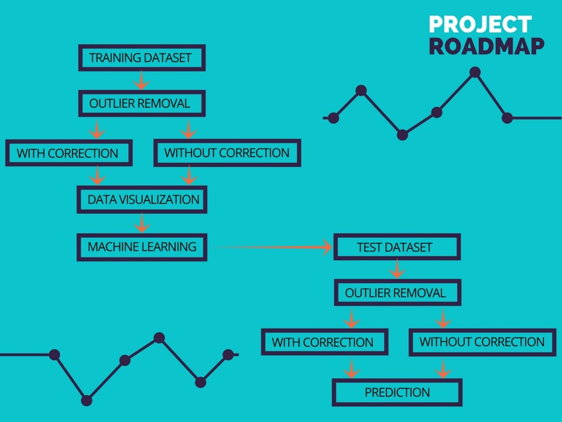
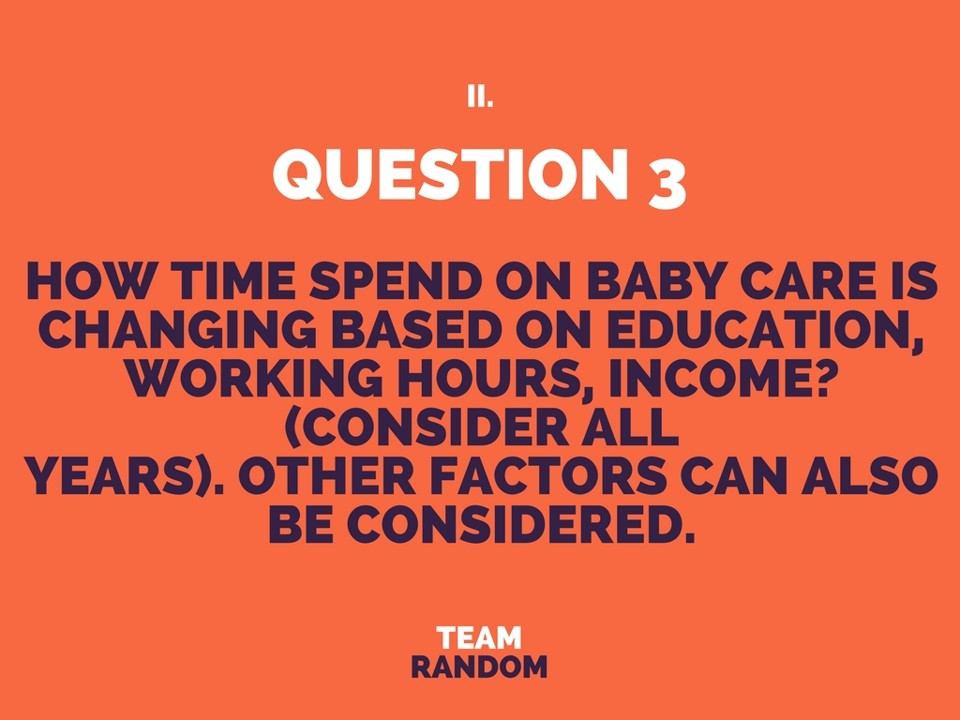
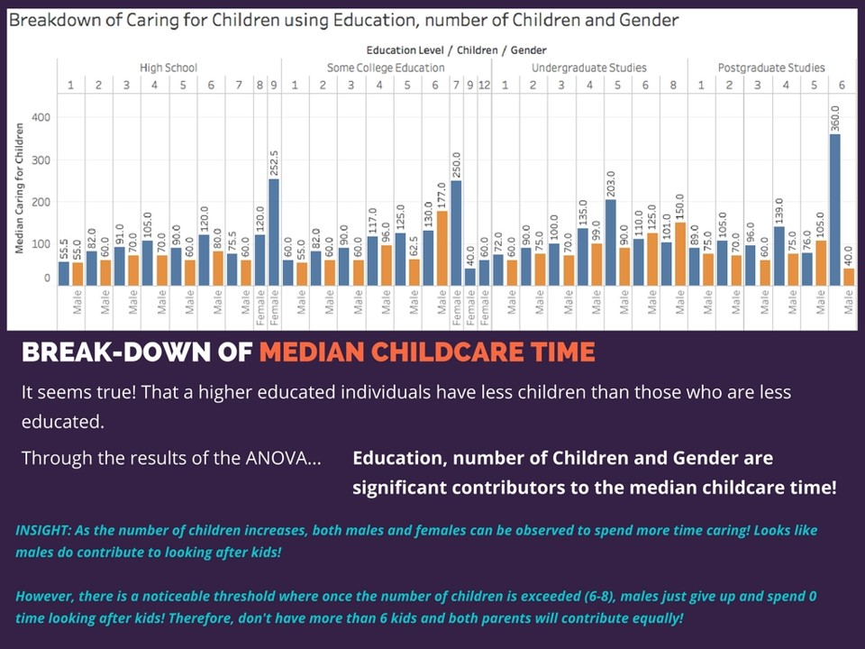
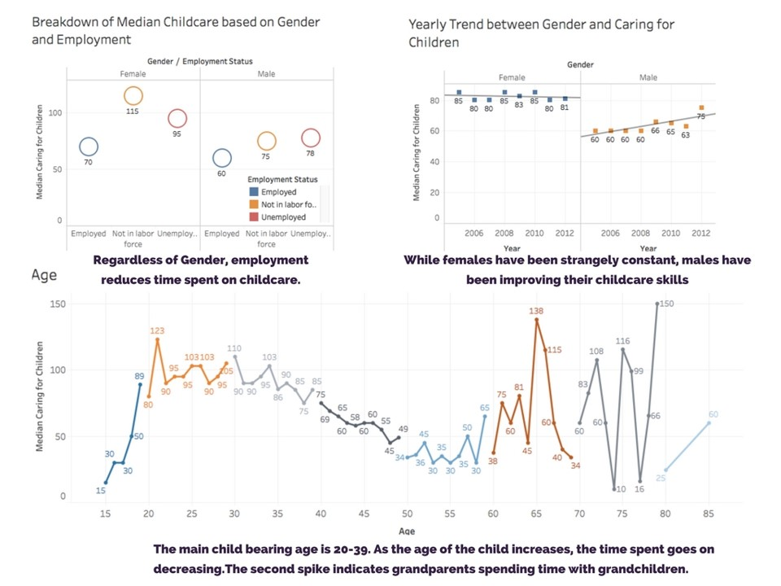

# US Consumer Time Spend Analysis

> An analysis of the time spending habbits of American consumers. 
The project was done as part of Round 1 of Intelligence Analytics Challenge 3.0 at the University of Texas at Dallas. The entire summary of the project can be found in the [project report](https://github.com/harshbg/US-Consumer-Time-Spend-Analysis/blob/master/UTD%20Random%20IAS%20Challenge%202018.pdf).

## Table of contents
* [General info](#general-info)
* [Screenshots](#screenshots)
* [Technologies and Tools](#technologies-and-tools)
* [Setup](#setup)
* [Code Examples](#code-examples)
* [Features](#features)
* [Status](#status)
* [Contact](#contact)

## General info

The data-set consists of employment related data for a period of 8 years, from 2005-2012. The data has been used to
answer 8 set of questions for the competition. A model to predict the employment status of and individual based on input data has also been developed.

## Screenshots





**The entire presentation of the project can be found [here](https://github.com/harshbg/US-Consumer-Time-Spend-Analysis/blob/master/UTD%20Random%20IAS%20Challenge%202018.pdf).**

## Technologies and Tools
* Microsoft R -version 3.4.3
* Tableau - version 10.5
* Microsoft Excel

## Setup
The test data used for exploratory analysis and model building can be found [here](https://github.com/harshbg/US-Consumer-Time-Spend-Analysis/blob/master/Training%20Dataset.xlsx). The code provided [here](https://github.com/harshbg/US-Consumer-Time-Spend-Analysis/blob/master/Team%20Random%20-%20Code.R) can be used in latest version of R to see the various outputs provided and replicate the model generated. The accuracy of the model can be tested using the test data-set [here](https://github.com/harshbg/US-Consumer-Time-Spend-Analysis/blob/master/Test%20Dataset.xlsx) 

## Code Examples

Some examples of usage:

```
#Support Vector Machine
colnames(train)

svm_con = list()

for(i in 1:4){
  
  train = newdata[sample[[i]],]
  test = newdata[-sample[[i]],]
  
  train_scale = scale(train[,-2]) # Excluding response
  test_scale = scale(test[,-2]) # Excluding response
  
  train_svm = cbind(train_scale,train$Employment_Status)
  test_svm = cbind(test_scale,test$Employment_Status)
  
  train_svm = as.data.frame(train_svm)
  test_svm = as.data.frame(test_svm)
  
  colnames(train_svm)[25] = 'Employment_Status'
  colnames(test_svm)[25] = 'Employment_Status'
  
  train_svm$Employment_Status = as.factor(train_svm$Employment_Status)
  test_svm$Employment_Status = as.factor(test_svm$Employment_Status)
  
  set.seed(1601)
  sv_model = svm(Employment_Status~., data = train_svm, kernel = "radial")
  sv_model
  summary(sv_model)
  
  pred_sv = predict(sv_model,test_svm)
  
  svm_con[[i]] = confusionMatrix(reference = test_svm$Employment_Status, data = pred_sv)
  
}

svm_con
multiclass.roc(response = test_svm$Employment_Status,
               predictor = as.numeric(pred_sv))
```

```
# Random Forest

rf_con = list()

for(i in  1:4){
  
  train = newdata[sample[[i]],]
  test = newdata[-sample[[i]],]
  
  train_scale = scale(train[,-2]) # Excluding response
  test_scale = scale(test[,-2]) # Excluding response
  
  train_rf = cbind(train_scale,train$Employment_Status)
  test_rf = cbind(test_scale,test$Employment_Status)
  
  train_rf = as.data.frame(train_rf)
  test_rf = as.data.frame(test_rf)
  
  colnames(train_rf)[25] = 'Employment_Status'
  colnames(test_rf)[25] = 'Employment_Status'
  
  train_rf$Employment_Status = as.factor(train_rf$Employment_Status)
  test_rf$Employment_Status = as.factor(test_rf$Employment_Status)
  
  set.seed(1601)
  rf_model = randomForest(x = train_rf[,-25],
                          y = train_rf$Employment_Status,
                          ntree = 500)
  
 ```
 
 ``` 
 #Predicting the Test set results
  pred_rf = predict(rf_model, newdata = test_rf[,-25])
  
  rf_con[[i]] = confusionMatrix(reference = test_rf$Employment_Status, data = pred_rf)
}

rf_con
multiclass.roc(response = test_rf$Employment_Status,
               predictor = as.numeric(pred_rf))   
```

## Features
* Prediction of employment status of an individual with ~85% accuracy.
* Insights to how an individual time spending habits and how it changes based on age/working status/education etc.
* Insights to how the great recession had an impact the way an individual spent their time.

## Status
Project is: _finished_ and we did progress to the final round of the competition. Our project for the final round can be found [here](https://github.com/harshbg/US-Housing-Price-Analysis). Be sure to check it out and see how we did in our final round. 

## Contact
Created by me and my awesome teammates Weiyang Sun and Sri Harish Popuri **Team Random**
Feel free to contact me! My other projects can be found [here](http://www.gupta-harsh.com/projects/).
